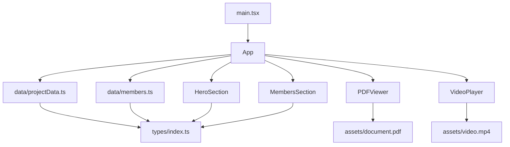

# Design Document — Microeconomía Landing Page

## Overview

La landing page es una aplicación web estática de una sola página construida con **React 18 + Vite + TypeScript**. No tiene backend, enrutador, ni llamadas a API: todo el contenido es estático y se entrega como un bundle compilado.

El objetivo de diseño es transmitir seriedad académica mediante una identidad visual inspirada en Harvard: acento granate (`#A41034`), tipografía serif para encabezados, fondo blanco y layout limpio centrado en 1200 px máximo. Los cuatro bloques de contenido — Hero, PDF Viewer, Video Player y Members — son componentes React independientes compuestos en `App.tsx` de arriba hacia abajo.

**Restricciones clave:**
- Sin CSS externo salvo el import base de Tailwind; todos los estilos usan clases de utilidad de Tailwind CSS v3.
- Sin `any` en firmas de props; todos los tipos de componente están definidos explícitamente.
- Todos los datos configurables viven en `src/data/`; los assets (PDF, video) en `src/assets/`.
- El build de producción debe completar en ≤ 60 s sin errores de TypeScript ni Vite.

---

## Architecture

### Árbol de componentes

```
App
├── HeroSection
├── PDFViewer
├── VideoPlayer
└── MembersSection
```

`App.tsx` es el único punto de composición. Cada componente recibe únicamente las props que necesita; no existe estado global ni contexto compartido — la página es completamente estática.

### Flujo de datos (unidireccional)

```
src/data/
  projectData.ts  ──▶  App.tsx  ──▶  HeroSection (props)
  members.ts      ──▶  App.tsx  ──▶  MembersSection (props)
src/assets/
  document.pdf    ──▶  PDFViewer (importado como URL)
  video.mp4       ──▶  VideoPlayer (importado como URL)
```

### Estructura de archivos

```
ProyectoFinalmicroeconomia/
├── index.html
├── vite.config.ts
├── tailwind.config.ts          ← Design System tokens
├── postcss.config.cjs
├── tsconfig.json
├── tsconfig.node.json
├── package.json
└── src/
    ├── main.tsx                ← entry point (ReactDOM.createRoot)
    ├── App.tsx                 ← composición raíz
    ├── index.css               ← @tailwind base/components/utilities
    ├── assets/
    │   ├── document.pdf
    │   └── video.mp4
    ├── data/
    │   ├── projectData.ts      ← metadata del proyecto (tema, institución, período)
    │   └── members.ts          ← lista tipada de integrantes
    ├── components/
    │   ├── HeroSection/
    │   │   └── index.tsx
    │   ├── PDFViewer/
    │   │   └── index.tsx
    │   ├── VideoPlayer/
    │   │   └── index.tsx
    │   └── MembersSection/
    │       └── index.tsx
    └── types/
        └── index.ts            ← interfaces compartidas (Member, ProjectData)
```

### Diagrama de dependencias de módulos



---

## Components and Interfaces

### `types/index.ts`

```typescript
export interface ProjectData {
  subject: string;           // e.g. "Microeconomía"
  topic: string;             // título del tema del proyecto
  description: string;       // párrafo ≤ 100 palabras
  institution: string;       // e.g. "Universidad Mariano Galvez"
  period: string;            // e.g. "Segundo Semestre 2026"
}

export interface Member {
  name: string;              // nombre completo (nombre + apellido)
}
```

---

### `HeroSection`

**Responsabilidad:** Presentar el contexto académico del proyecto con jerarquía tipográfica clara y acento granate.

**Props:**
```typescript
interface HeroSectionProps {
  data: ProjectData;
}
```

**Estructura HTML semántica:**
```
<section aria-labelledby="hero-heading">
  <div>                        ← contenedor centrado max-w-5xl
    <span>                     ← barra de acento granate (accent element)
    <h1 id="hero-heading">     ← subject (serif, text-4xl/5xl)
    <h2>                       ← topic (serif, text-2xl/3xl)
    <p>                        ← description (sans, text-base/lg)
    <p>                        ← institution + period (sans, text-sm, muted)
```

**Decisiones de diseño:**
- La barra de acento es un `<span>` con `block w-16 h-1 bg-harvard-crimson mb-6` — simple, sin SVG externo.
- El `h1` usa `font-serif` del Design System para respetar la identidad visual.
- Padding horizontal mínimo de 16 px en móvil (clase `px-4`) cumple el req 3.6.

---

### `PDFViewer`

**Responsabilidad:** Embeber el PDF para lectura in-page y ofrecer descarga directa.

**Props:**
```typescript
interface PDFViewerProps {
  pdfUrl: string;            // URL importada desde src/assets/document.pdf
  documentTitle: string;     // usado en aria-label y como nombre de descarga
}
```

**Estructura HTML semántica:**
```
<section aria-labelledby="pdf-heading">
  <h2 id="pdf-heading">      ← "Documento del Proyecto"
  <div>                      ← contenedor del viewer
    <object                  ← elemento de embed principal
      data={pdfUrl}
      type="application/pdf"
      aria-label={...}
    >
      <p>                    ← fallback visible si el PDF no carga
    </object>
  <a href={pdfUrl} download> ← botón de descarga
    "Descargar PDF"
```

**Decisiones de diseño:**
- Se usa `<object>` en lugar de `<iframe>` porque es el elemento semántico correcto para recursos embebidos y admite fallback nativo vía contenido hijo.
- En móvil (`< 768px`) la altura del viewer se reduce a 400 px mediante clase `md:h-[600px] h-[400px]`.
- El botón de descarga es un `<a>` con atributo `download` — sin JavaScript, sin fetch — garantiza la descarga nativa del navegador.
- Tap target mínimo 44×44 px en móvil: `min-h-[44px] min-w-[44px] px-6 py-3`.

---

### `VideoPlayer`

**Responsabilidad:** Reproducir el video explicativo con controles nativos y sin autoplay.

**Props:**
```typescript
interface VideoPlayerProps {
  videoUrl: string;          // URL importada desde src/assets/video.mp4
  title: string;             // para aria-label y heading
}
```

**Estructura HTML semántica:**
```
<section aria-labelledby="video-heading">
  <h2 id="video-heading">    ← title (serif)
  <div class="aspect-video"> ← contenedor 16:9 (Tailwind aspect-video)
    <video
      controls
      aria-label={...}
    >
      <source src={videoUrl} type="video/mp4" />
      <p>                    ← fallback texto si el video no carga
```

**Decisiones de diseño:**
- `aspect-video` de Tailwind (`aspect-ratio: 16/9`) mantiene la proporción correcta en todos los viewports sin JS.
- Sin atributo `autoplay` por requerimiento explícito (req 5.3).
- El fallback es un `<p>` dentro de `<video>` — la semántica correcta para navegadores que no soportan video HTML5.

---

### `MembersSection`

**Responsabilidad:** Listar los integrantes del grupo en tarjetas con acento granate.

**Props:**
```typescript
interface MembersSectionProps {
  members: Member[];
}
```

**Estructura HTML semántica:**
```
<section aria-labelledby="members-heading">
  <h2 id="members-heading">  ← "Integrantes del Grupo" (serif)
  <ul role="list">
    <li> × N               ← tarjeta por integrante
      <div>                  ← borde superior granate (border-t-4 border-harvard-crimson)
      <span>                 ← nombre completo (sans, font-medium)
```

**Decisiones de diseño:**
- Grid de 2 columnas en `≥ 768px` (`sm:grid-cols-2`) y 1 columna en móvil (`grid-cols-1`).
- Borde superior `border-t-4 border-harvard-crimson` como tratamiento de acento — consistente en todas las tarjetas.
- `<ul>` con `role="list"` restablece la semántica de lista que algunos reset de CSS eliminan.

---

### `App.tsx`

**Responsabilidad:** Ensamblar todos los componentes en el orden correcto, importar datos y assets.

```typescript
// Orden de composición (req 1.5):
// Hero → PDF Viewer → Video Player → Members
//
// Separadores entre secciones: <hr className="border-t border-neutral-200" />
```

**Decisiones de diseño:**
- `<hr>` con `border-t border-neutral-200` implementa el separador de 1 px entre secciones (req 2.7).
- El contenedor raíz usa `max-w-[1200px] mx-auto px-4` para centrar el contenido a 1280 px+ (req 2.8).
- `App.tsx` no contiene lógica ni estado; es puramente declarativo.

---

## Data Models

### `src/data/projectData.ts`

```typescript
import type { ProjectData } from '../types';

export const projectData: ProjectData = {
  subject: 'Microeconomía',
  topic: 'Título específico del tema del proyecto',       // reemplazar con el tema real
  description:
    'Descripción breve del proyecto en no más de cien palabras. ' +
    'Introduce el tema, el enfoque de análisis y la relevancia académica ' +
    'del estudio dentro de la asignatura de Microeconomía.',
  institution: 'Universidad Mariano Galvez de Guatemala',   // reemplazar si aplica
  period: 'Segundo Semestre 2026',
};
```

### `src/data/members.ts`

```typescript
import type { Member } from '../types';

export const members: Member[] = [
  { name: 'Nombre Apellido 1' },
  { name: 'Nombre Apellido 2' },
  // ... hasta 20 integrantes
];
```

### Manejo de assets en Vite

Vite trata los imports de assets binarios como módulos que resuelven a URLs en runtime:

```typescript
// En App.tsx o en los componentes directamente:
import pdfUrl from './assets/document.pdf';
import videoUrl from './assets/video.mp4';
```

- En desarrollo: la URL apunta al servidor de dev de Vite.
- En producción: Vite copia el asset al directorio `dist/assets/` y reemplaza la URL con el hash de contenido.
- Esto garantiza cache-busting automático sin configuración adicional.

**Declaración de tipos para assets no-JS** (necesario en TypeScript):

```typescript
// src/vite-env.d.ts (generado por Vite, extender si es necesario)
/// <reference types="vite/client" />
```

Vite/client ya incluye declaraciones para `*.pdf` y `*.mp4` como `string` URLs, por lo que no se requieren declaraciones adicionales.

---

## Design System (tailwind.config.ts)

```typescript
import type { Config } from 'tailwindcss';

const config: Config = {
  content: ['./index.html', './src/**/*.{ts,tsx}'],
  theme: {
    extend: {
      colors: {
        'harvard-crimson': '#A41034',   // acento principal (req 2.1)
        'page-bg': '#FFFFFF',           // fondo de página (req 2.2)
        'text-primary': '#1a1a1a',      // texto principal (req 2.3)
        'text-muted': '#6b7280',        // texto secundario / metadata
        'neutral-divider': '#e5e7eb',   // separadores de sección (req 2.7)
      },
      fontFamily: {
        serif: ['"EB Garamond"', 'Georgia', 'serif'],       // encabezados (req 2.4)
        sans: ['"Source Sans 3"', 'Inter', 'sans-serif'],   // cuerpo (req 2.5)
      },
      spacing: {
        '1': '4px',    // 4px
        '2': '8px',    // 8px
        '4': '16px',   // 16px
        '6': '24px',   // 24px
        '8': '32px',   // 32px
        '12': '48px',  // 48px
        '16': '64px',  // 64px
      },
      maxWidth: {
        content: '1200px',  // ancho máximo del contenedor (req 2.8)
      },
    },
  },
  plugins: [],
};

export default config;
```

**Fuentes web:** `EB Garamond` y `Source Sans 3` se cargan desde Google Fonts mediante un `<link>` en `index.html` — sin dependencias npm de fuentes.

```html
<!-- index.html <head> -->
<link rel="preconnect" href="https://fonts.googleapis.com" />
<link rel="preconnect" href="https://fonts.gstatic.com" crossorigin />
<link
  href="https://fonts.googleapis.com/css2?family=EB+Garamond:wght@400;600;700&family=Source+Sans+3:wght@400;500;600&display=swap"
  rel="stylesheet"
/>
```

---

## Responsive Layout Strategy

| Breakpoint | Tailwind prefix | Comportamiento |
|---|---|---|
| < 375px | (base) | Una columna, `px-4` en todos los componentes |
| 375px – 767px | (base) | Una columna, padding consistente |
| 768px – 1279px | `md:` | Dos columnas donde aplica (MembersSection), PDF viewer a 600px de alto |
| ≥ 1280px | `lg:` | Contenedor centrado `max-w-content mx-auto`, layouts de dos columnas activos |

**Patrones concretos por componente:**

- **HeroSection:** `px-4 md:px-8` — siempre una columna (texto), texto crece con `text-3xl md:text-5xl`.
- **PDFViewer:** `h-[400px] md:h-[600px]` — altura adaptativa del viewer; botón `w-full md:w-auto`.
- **VideoPlayer:** `aspect-video w-full` — Tailwind mantiene 16:9 en cualquier ancho automáticamente.
- **MembersSection:** `grid grid-cols-1 md:grid-cols-2 gap-4` — dos columnas en tablet/desktop.
- **Contenedor raíz en App:** `max-w-[1200px] mx-auto px-4` — centrado en 1280px+.

---

## Accessibility Implementation

### Jerarquía de encabezados

```
h1 — Microeconomía (HeroSection, única h1 de la página)
h2 — Título del tema (HeroSection)
h2 — "Documento del Proyecto" (PDFViewer)
h2 — Título del video (VideoPlayer)
h2 — "Integrantes del Grupo" (MembersSection)
```

### aria-labels en elementos interactivos y embebidos

| Elemento | aria-label |
|---|---|
| `<object>` del PDF | `"Documento PDF: {documentTitle}"` |
| `<a>` de descarga PDF | `"Descargar {documentTitle} en formato PDF"` |
| `<video>` | `"Video explicativo: {title}"` |

### Contraste de color (WCAG 2.1 AA)

| Par de colores | Ratio estimado | Cumple AA |
|---|---|---|
| `#1a1a1a` sobre `#FFFFFF` | ~19:1 | ✅ normal + large |
| `#A41034` sobre `#FFFFFF` | ~7.2:1 | ✅ normal + large |
| `#6b7280` sobre `#FFFFFF` | ~4.6:1 | ✅ normal text |
| `#FFFFFF` sobre `#A41034` | ~7.2:1 | ✅ (botón descarga) |

### Imágenes decorativas

No hay imágenes `` en el diseño base. Si se agregan logos o decoraciones, se usa `alt=""` para marcarlas como decorativas.

### Foco del teclado

Todos los elementos interactivos (`<a>`, `<video controls>`) son alcanzables por teclado de forma nativa. El botón de descarga como `<a>` recibe el estilo de foco de Tailwind mediante `focus-visible:ring-2 focus-visible:ring-harvard-crimson`.

---


## Correctness Properties

*A property is a characteristic or behavior that should hold true across all valid executions of a system — essentially, a formal statement about what the system should do. Properties serve as the bridge between human-readable specifications and machine-verifiable correctness guarantees.*

---

### Property 1: Responsive layout conforms to breakpoint rules

*For any* viewport width in the valid range [320px, 1920px], the rendered layout SHALL conform to the breakpoint rules: at widths < 768px all content is arranged in a single column; at widths ≥ 768px the MembersSection grid becomes two columns and the PDF viewer height is ≥ 600px; at widths ≥ 1280px the main container is centered with a maximum width of 1200px.

**Validates: Requirements 2.8, 3.6, 4.2, 4.5, 6.4**

---

### Property 2: aria-labels contain the provided title strings

*For any* valid non-empty `documentTitle` string passed to `PDFViewer`, and *for any* valid non-empty `title` string passed to `VideoPlayer`, the rendered aria-label attributes on the embedded `<object>` element, the download `<a>` element, and the `<video>` element SHALL each contain the respective title string.

**Validates: Requirements 4.6, 5.5**

---

### Property 3: Video container maintains 16:9 aspect ratio

*For any* viewport width from 320px to 1920px, the `VideoPlayer` container element SHALL maintain a 16:9 aspect ratio (width / height ≈ 1.778) with a tolerance of ±0.01.

**Validates: Requirements 5.2**

---

### Property 4: Member list renders all names with consistent accent

*For any* non-empty array of 1 to 20 `Member` objects, rendering `MembersSection` SHALL produce exactly one rendered item per member where: (a) the member's `name` string is present in the rendered output, and (b) every card element carries the granate accent class (`border-harvard-crimson`).

**Validates: Requirements 6.2, 6.5**

---

## Error Handling

### PDF no disponible (req 4.4)

Cuando el navegador no puede renderizar el PDF dentro del `<object>`, el navegador muestra automáticamente el contenido hijo del elemento como fallback. El componente coloca un `<p>` con texto visible dentro del `<object>`:

```tsx
<object data={pdfUrl} type="application/pdf" aria-label={...} className="...">
  <p className="text-text-primary p-4">
    No fue posible cargar el documento. Por favor{' '}
    <a href={pdfUrl} download className="text-harvard-crimson underline">
      descárgalo aquí
    </a>
    .
  </p>
</object>
```

**Por qué `<object>` en lugar de `<iframe>`:** el elemento `<object>` admite contenido hijo como fallback nativo en todos los navegadores modernos; `<iframe>` no tiene fallback estándar.

### Video no disponible (req 5.6)

El elemento `<video>` muestra su contenido hijo si el navegador no puede reproducir ninguna de las fuentes declaradas:

```tsx
<video controls aria-label={...} className="w-full h-full">
  <source src={videoUrl} type="video/mp4" />
  <p className="text-text-primary p-4">
    El video no está disponible en este momento.
  </p>
</video>
```

### Errores de TypeScript en tiempo de compilación

- Props sin tipado o uso de `any` son errores de compilación capturados antes del build.
- Datos configurables mal formados (p. ej., `description` > 100 palabras) son capturados en tests unitarios.

### Build fallido (req 1.7)

No hay manejo en runtime — si el build falla, el pipeline se detiene con código de salida distinto de cero. El objetivo es zero errores en compilación.

---

## Testing Strategy

### Enfoque dual: tests de ejemplo + tests de propiedades

| Tipo | Herramienta | Cuándo usarlo |
|---|---|---|
| Tests de ejemplo (unit) | Vitest + React Testing Library | Comportamientos concretos, estados de error, DOM structure |
| Tests de propiedades (PBT) | fast-check (npm) | Properties 1–4: inputs generados aleatoriamente |

**fast-check** es la biblioteca de PBT para TypeScript/JavaScript más madura y activamente mantenida. Se integra nativamente con Vitest.

---

### Tests de ejemplo (unit)

Cada componente tiene su propio archivo de test en `src/components/{ComponentName}/index.test.tsx`.

**HeroSection:**
- Renderiza `h1` con el `subject` del `ProjectData`.
- Renderiza `h2` con el `topic`.
- Renderiza institución y período.
- Renderiza el elemento de acento (tiene clase `bg-harvard-crimson` o `border-harvard-crimson`).

**PDFViewer:**
- Renderiza `<object>` con el `pdfUrl` en el atributo `data`.
- Renderiza `<a>` con atributo `download` y clase de color granate.
- El fallback `<p>` existe dentro del `<object>`.

**VideoPlayer:**
- Renderiza `<video>` con atributo `controls`.
- NO tiene atributo `autoplay`.
- Renderiza `<h2>` con el `title`.
- El fallback `<p>` existe dentro de `<video>`.

**MembersSection:**
- Renderiza `<h2>` con texto "Integrantes del Grupo".
- Renderiza exactamente `N` items para un array de `N` miembros.

**App:**
- Las secciones aparecen en el orden correcto: Hero → PDF → Video → Members.
- Existen separadores `<hr>` entre secciones.

**Contraste WCAG:**
- Test parametrizado sobre los pares de colores del Design System: computa el ratio de contraste con la fórmula WCAG y verifica los umbrales (4.5:1 para texto normal, 3:1 para texto grande).

---

### Tests de propiedades (PBT) — fast-check

Cada test de propiedad se configura con un mínimo de **100 iteraciones**. Cada test referencia la propiedad del documento de diseño mediante un comentario de etiqueta.

#### Propiedad 1: Responsive layout conforms to breakpoint rules

```typescript
// Feature: microeconomia-landing-page
// Property 1: For any viewport width in [320, 1920], layout conforms to breakpoint rules
it('responsive layout conforms to breakpoint rules', () => {
  fc.assert(
    fc.property(fc.integer({ min: 320, max: 1920 }), (viewportWidth) => {
      // Set jsdom window width, render App, assert column count and max-width
      // via computed classes on root container and grid elements
    }),
    { numRuns: 100 }
  );
});
```

#### Propiedad 2: aria-labels contain the provided title strings

```typescript
// Feature: microeconomia-landing-page
// Property 2: For any documentTitle and videoTitle, rendered aria-labels contain those strings
it('aria-labels contain the provided title strings', () => {
  fc.assert(
    fc.property(
      fc.string({ minLength: 1 }),
      fc.string({ minLength: 1 }),
      (documentTitle, title) => {
        // Render PDFViewer with documentTitle, VideoPlayer with title
        // Assert aria-labels include the respective strings
      }
    ),
    { numRuns: 100 }
  );
});
```

#### Propiedad 3: Video container maintains 16:9 aspect ratio

```typescript
// Feature: microeconomia-landing-page
// Property 3: For any viewport width [320, 1920], VideoPlayer container maintains 16:9 ratio
it('video container maintains 16:9 aspect ratio across viewports', () => {
  fc.assert(
    fc.property(fc.integer({ min: 320, max: 1920 }), (viewportWidth) => {
      // Render VideoPlayer, compute container dimensions, verify ratio ≈ 1.778 ± 0.01
    }),
    { numRuns: 100 }
  );
});
```

#### Propiedad 4: Member list renders all names with consistent accent

```typescript
// Feature: microeconomia-landing-page
// Property 4: For any member array [1, 20], all names appear and all cards have accent class
it('member list renders all names with consistent granate accent', () => {
  fc.assert(
    fc.property(
      fc.array(
        fc.record({ name: fc.string({ minLength: 1 }) }),
        { minLength: 1, maxLength: 20 }
      ),
      (members) => {
        // Render MembersSection with members array
        // Assert each member.name appears in output
        // Assert all card elements have border-harvard-crimson class
      }
    ),
    { numRuns: 100 }
  );
});
```

---

### Consideraciones adicionales de testing

- **No PBT en build/config:** Los requisitos de estructura de proyecto (1.1–1.7), design system (2.1–2.6), y restricciones arquitecturales (7.3–7.5) se verifican con smoke tests (build command + TypeScript strict mode + ESLint).
- **Snapshot tests:** No se incluyen snapshot tests de componentes — los tests de propiedad y ejemplo ya cubren el comportamiento observable. Los snapshots tienden a volverse mantenimiento sin valor añadido en proyectos estáticos.
- **Comandos de test:**
  - `npx vitest --run` — ejecuta todos los tests una vez (sin watch mode).
  - `npx vitest --run --coverage` — agrega reporte de cobertura.

